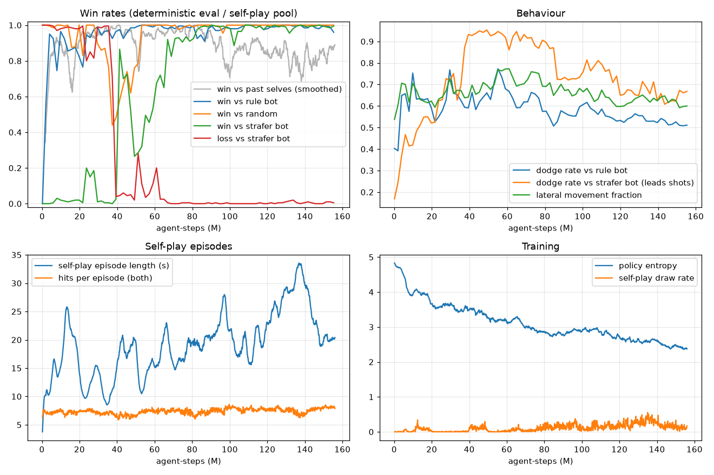

# Pip's Arena — a neon 2D dodge & shoot game against a self-play-trained reflex AI

A top-down neon arena shooter. You fight **Pip**, a small neural network that learned the game
purely by playing against itself: it moves, dodges, leads its shots, uses cover and picks up
weapons. Modes: duel vs Pip (5 difficulty levels), two players on one keyboard, and wave survival.
Native 1920x1080, maps with cover, pickups (shotgun, rapid fire, railgun, shield, heal).

> **Status:** the sections below "Setup" and "Play" document the v1 AI (open 800x600 arena).
> A v2 AI for the 1920x1080 maps with cover and pickups is being trained (warm-started from v1);
> this README will be updated with its results.

The AI's every decision (move direction, aim, fire) is **one forward pass of a small MLP per
frame**. There are no hand-coded rules, no search, and no LLM. The MLP was trained from a random
init purely by **self-play PPO** on the GPU. Everything is local: no server, no network, one
process.

```
python play.py
```

---

## Setup

Windows / Python 3.14, RTX 5070 (Blackwell needs CUDA 12.8+ PyTorch wheels):

```powershell
python -m venv .venv
.\.venv\Scripts\python -m pip install torch --index-url https://download.pytorch.org/whl/cu128
.\.venv\Scripts\python -m pip install numpy pygame-ce matplotlib pytest
.\.venv\Scripts\activate
```

`pygame-ce` is a drop-in pygame fork (`import pygame`) that ships Python 3.14 wheels.

Device selection is one value in `config.py`: `DEVICE = "auto"` (CUDA if available, else CPU),
or force `"cuda"` / `"cpu"`.

## Play

```
python play.py                                   # main menu (Hungarian UI)
python play.py --mode duel --difficulty hard     # jump straight into a duel
python play.py --mode survival                   # jump straight into survival
```

### Modes

- **Párbaj (duel):** 1v1, first to 3 rounds. Each round has:
  - a 3-2-1 countdown
  - hit-stop on the killing blow
  - a slow-motion kill-cam replay of the last 1.5 s (Space skips it).

  The results screen shows accuracy, hits, dodges and shots for you vs the AI. Your match record
  is kept per difficulty.
- **Túlélés (survival):** waves of AI enemies (1 → 6 at once, weakest to strongest). You have
  10 HP and heal +3 after each wave. Enemies have 3 HP. Scoring:
  - 100 × wave per kill
  - 250 × wave per cleared wave
  - +500 for a flawless wave.

  The high score is saved. Each enemy is the same trained 1v1 policy seeing its own duel view
  against you, so multi-enemy play needs no retraining.

### Difficulty (measured, 400 games each, `world.DIFFICULTIES`)

The AI is handicapped like a human: it acts on what it saw N frames ago (reaction time) and gets
Gaussian aim noise. The two right-hand columns are the AI's win rate against each bot.

| Level | Model | Reaction delay | Aim noise | Win vs rule bot | Win vs strafer |
|---|---|---|---|---|---|
| Kezdő (beginner) | ckpt_0100, sampled | 250 ms | 10° | 17% | 0% |
| Könnyű (easy) | ckpt_0300, sampled | 133 ms | 5° | 39% | 0% |
| Közepes (medium) | best, sampled | 67 ms | 0° | 75% | 18% |
| Nehéz (hard) | best, sampled | 33 ms | 0° | 86% | 88% |
| Lehetetlen (impossible) | best, argmax | 0 | 0° | 99% | 99% |

### Controls

| Control | Action |
|---|---|
| WASD / arrow keys | move (8 directions) |
| Mouse | aim |
| Left click / Space (hold) | shoot (0.3 s cooldown, shown as the ring around you) |
| Esc / P | pause menu (resume, restart, main menu, quit) |
| Tab | AI debug overlay (each AI's chosen move, inference time per frame) |
| M | sound on/off |

### Look & sound

**Look:**
- Neon style with additive glow sprites for agents, projectiles and particles.
- Gaussian-blur bloom on titles.
- Letter-spaced Bahnschrift UI and a live AI-vs-AI match behind the menus.
- Fade transitions, cinematic round banners, spark particles, shock-wave rings.
- A cooldown ring on the crosshair and a soft red vignette when hit or low on HP.

**Screens:**
- main menu → opponent select (5 cards with reaction time, strength, per-level record) → duel
- survival
- settings: volume slider, screen shake, AI debug overlay
- controls: keycap diagram
- pause
- results: you-vs-AI comparison bars.

**Input:** every widget works with mouse (hover focuses, activation on button *release*, so the
click that starts a match never fires a shot) and with keyboard (arrows/WASD, Enter, Esc = back).

**Sound (`sound.py`):**
- Everything is synthesised with numpy at startup: soft sine/FM tones, FFT-filtered noise, a
  small convolution reverb.
- Stereo panning follows the on-screen position.
- Spectral centroid of the shot is ~1.4 kHz, down from 3.5 kHz for the first square-wave version.

Settings, records and high scores live in `save.json` next to `play.py`. Set the `ARENA_SAVE`
environment variable to use another file (the tests do).

### How the game runs the AI

The game runs the AI on CPU as a plain numpy MLP. For a single observation this is faster than
torch-CPU or CUDA (see timings below). `world.World` is the play-time N-agent version of the
engine. `tests/test_world.py` checks that in a 1v1 it produces bit-for-bit the same trajectories
and AI observations as the training engine.

### Headless / testing flags

- `--bot strafer` lets a scripted bot play for you.
- `--frames N --fast` runs N frames without the 60 fps cap.
- `--shots-dir DIR --shots-every N` saves screenshots.

With the strafer bot as the player, it won medium-difficulty duel rounds and reached waves 5–6
in survival.

## Retrain from scratch

```
python -m pytest -q tests                    # 25 engine/world/encoding/model tests
python train.py --minutes 3 --run smoke      # pipeline check (~12M agent-steps)
python train.py --minutes 40 --run main      # the real run (~156M agent-steps)
python evaluate.py --ckpt runs/main/best.pt --games 1000
python plot.py runs/main                     # re-render runs/main/reward_curve.png
```

`train.py` writes `runs/<run>/log.csv` (one row per PPO iteration), `ckpt_XXXX.pt` every 25
iterations, `latest.pt`, `final.pt`, and `reward_curve.png`. Every 15 iterations it evaluates the
current policy (argmax) against all three baseline bots, 200 games each. These bots are **never
trained against**; they serve only as held-out measuring sticks.

`best.pt` is a copy of `ckpt_1050.pt`, picked by the checkpoint sweep described below.

---

## Game rules (`engine.py`, constants in `config.py`)

| | |
|---|---|
| Arena | 800 × 600, 60 ticks/s, 1 tick = 1 frame |
| Agent | radius 14, max speed 4/tick, velocity eases toward target (accel 0.35), 5 HP |
| Projectile | radius 4, speed 10/tick, 1 damage, cooldown 18 ticks, ≤ 8 alive per agent |
| Collisions | swept segment-vs-circle hits (no tunnelling); projectiles die at arena edge or in obstacles; agents clamp to arena, get pushed out of obstacles and apart from each other |
| Round end | 0 HP = loss; both at 0 on the same tick = draw; 45 s = draw |
| Obstacles | supported by engine, encoding, rendering and tests (`config.OBSTACLES`), empty in v1 |

The engine is fully vectorised numpy with a leading batch dimension. `Arena(1)` is the interactive
game, and `Arena(512)` is 512 training games stepped at once (~560k agent-steps/s for sim +
encoding alone).

## State encoding (`encoding.py`): 67 floats, egocentric, roughly in [-1, 1]

| Index | Features | # |
|---|---|---|
| 0–5 | self: x, y (to [-1,1]), vx, vy (/max speed), HP fraction, cooldown fraction | 6 |
| 6–14 | opponent: dx/W, dy/H, distance/diagonal, cos & sin of bearing, vx, vy, HP fraction, cooldown fraction | 9 |
| 15 | line of sight to opponent (1 = clear) | 1 |
| 16–23 | ray distance to nearest wall/obstacle in 8 directions (0°, 45°, …), /diagonal | 8 |
| 24–65 | 6 incoming enemy projectiles × 7: dx/W, dy/H, vx, vy (/proj speed), **predicted miss distance**/100, **ticks to closest approach**/60, present flag | 42 |
| 66 | fraction of round time remaining | 1 |

"Incoming" means projectiles moving toward the agent (closest approach in the future) whose miss
distance is < 200. They are sorted by time to closest approach, and empty slots are zero-padded.

## Action space: three discrete heads, one decision per tick

| Head | Choices |
|---|---|
| move | 9: stop + 8 compass directions |
| aim | 7: offset from the line to the opponent: −30°, −20°, −10°, 0°, +10°, +20°, +30° (the net must learn when and how much to lead) |
| shoot | 2: no / yes; softmax probability = confidence (shown in the debug overlay). Fires only if off cooldown |

## Network (`model.py`)

- **Actor (used at play time):** 67 → 256 → 256 → [9 | 7 | 2], tanh, orthogonal init.
  **87,826 parameters**, ~0.1 MFLOP per decision.
- **Critic (training only):** 67 → 256 → 256 → 1. No weight sharing with the actor.

## Training (`train.py`): from-scratch PPO, self-play

- 512 parallel games. Both agents' experience is trained on, giving 1024 samples/tick. Rollout 128
  ticks gives 131k samples per iteration. 4 epochs, minibatch 8192.
- Opponents:
  - 80% of games: current policy vs itself.
  - 20%: current policy vs a frozen past snapshot. A pool of the last 20 snapshots, one taken
    every 10 iterations, guards against strategy cycling.
- γ = 0.995 (≈ 3 s horizon at 60 Hz), GAE λ = 0.95, clip 0.2, Adam 3e-4 linearly decayed to
  6e-5, entropy coefficient 0.01 → 0.001, grad-norm clip 0.5.
- Reward, per agent per tick:
  - +1 per hit landed, −1 per hit taken
  - +5 for the win, −5 for the loss
  - −0.001 per tick (anti-stalling).
- Rollouts step numpy on CPU. Policy inference and PPO updates run on CUDA.

**Actual run:** 40 min on the RTX 5070, 1190 iterations, **156M agent-steps**, ~65k–120k
agent-steps/s.

A note on the "reward curve": in symmetric self-play the mean episode reward is ≈ 0 by
construction (zero-sum). `reward_curve.png` therefore plots the signals that do move:
- win rate against past snapshots
- periodic win/loss rates against the held-out bots
- dodge rate and strafing fraction
- episode length
- entropy



### What the curve shows

- **0–4M steps:** it learns to aim and fire, and beats the rule bot (>90%).
- **4–38M:** it beats the rule bot but loses **~98–100%** to the strafer, which dodges almost
  everything and leads its shots.
- **~38M:** it learns to survive the strafer. Losses drop from 71% to 4%, and dodging its lead
  shots jumps to 93%, but most games end as timeout draws.
- **~40–60M:** it learns to *kill* the strafer. Wins go 2.5% → 86%, then oscillate 25–90% as
  self-play strategies cycle.
- **~80M onward:** it is stable at 90–100% against both bots.

There is visible self-play oscillation along the way, which is why the final model is picked by a
checkpoint sweep rather than just using `final.pt`.

## Evaluation (`evaluate.py`)

The trained AI plays as agent 0. Each of the 1000 games is one full round from a random spawn. Metrics:
- **dodge:** the fraction of opponent shots that were on a collision course with the AI within
  0.5 s but did **not** hit it.
- **lateral:** the fraction of the AI's movement perpendicular to the line to its opponent
  (0 = pure chasing, 1 = pure strafing).

### Baselines

- **random:** uniform random action every tick.
- **rule:** walks straight at you, aims straight at you, fires on cooldown (as specified).
- **strafer:** a stronger scripted bot added because the first two turned out too weak to
  measure progress. It:
  - keeps ~250 units away and circle-strafes (randomly reversing, bouncing off walls)
  - **leads** its shots with an exact intercept solution
  - **side-steps** any projectile on a collision course within 25 ticks.

| Reference matchup (1000 games) | win | draw | loss | dodge |
|---|---|---|---|---|
| rule vs random | 100.0% | 0.0% | 0.0% | 0% |
| strafer vs rule | 100.0% | 0.0% | 0.0% | 92.5% |
| strafer vs strafer | 0.2% | 99.8% | 0.0% | 97.9% |

### Checkpoint selection

Checkpoints 500, 550, …, 1150 and `final` were each played 500 games vs rule and vs strafer
(seed 7). The winner by min(win vs rule, win vs strafer) was **ckpt_1050**, which became
`best.pt`. The table below uses a **different seed (123)**, so it isn't the same games the
selection was made on.

### Results (1000 games per row, seed 123)

| Model | Opponent | win | draw | loss | avg time to win | dodge | lateral |
|---|---|---|---|---|---|---|---|
| **best.pt** (argmax) | random | **100.0%** | 0.0% | 0.0% | 2.6 s | 69.5% | 0.60 |
| **best.pt** (argmax) | rule | **99.4%** | 0.2% | 0.4% | 1.8 s | 53.5% | 0.63 |
| **best.pt** (argmax) | strafer | **99.8%** | 0.1% | 0.1% | 7.6 s | 71.0% | 0.65 |
| best.pt (sampled) | rule | 97.4% | 0.6% | 2.0% | 1.9 s | 53.0% | 0.63 |
| best.pt (sampled) | strafer | 99.8% | 0.0% | 0.2% | 8.1 s | 75.4% | 0.62 |
| final.pt (it 1190) | rule | 96.1% | 1.1% | 2.8% | 1.8 s | 50.2% | 0.60 |
| final.pt (it 1190) | strafer | 98.7% | 0.4% | 0.9% | 6.3 s | 62.6% | 0.62 |
| smoke (3 min, 12M steps) | rule | 99.5% | 0.5% | 0.0% | 1.4 s | 81.6% | 0.80 |
| smoke (3 min, 12M steps) | strafer | 2.8% | 0.0% | **97.2%** | – | 24.1% | 0.80 |

The average time to lose is only meaningful where there are losses: best.pt lost in 2.7 s on
average vs rule and 4.6 s vs strafer.

### How it beats the strafer (behaviour analysis, best.pt, 300 games)

- **It closes in instead of kiting.**
  - The average distance is 153 units, although the strafer tries to hold 250.
  - When the AI lands a hit, the median distance is 79 units and the strafer is a median 70 units
    from a wall. That is exactly where the strafer's wall avoidance kicks in.
  - In other words, it corners the strafer, and at that range the strafer's 25-tick dodge window
    can't save it.
- **It spreads its shots.** Aim offsets are used almost uniformly across −10° / 0° / +10° (34 /
  33 / 32%), bracketing the strafer's side-step in either direction. Accuracy vs the strafer is
  19.7% per shot, firing at the maximum rate (3.33 shots/s).
- **It jukes.**
  - It changes movement direction ~11 times per second and never stands still (0.0% of ticks).
  - 65% of its movement is lateral.
  - It dodges 71% of the strafer's lead shots that were on target (75% when sampling).

### Honest caveats

- **Random bot.** It is not a meaningful opponent. Thanks to the relative-aim action space, even
  the untrained network beat it 100% at iteration 1.
- **Dodge numbers vs the rule bot.** They are lower for best.pt (53%) than for the smoke model
  (81%). best.pt ends those fights in 1.8 s by trading shots at close range rather than dancing
  around. The dodge metric vs the rule bot mostly reflects play style, not skill.
- **The strafer is my own scripted bot.** It is a fair but limited yardstick. A human is less
  predictable. Try `--stochastic` if the argmax AI feels too mechanical.

## Inference timing (CPU, single observation, otherwise idle machine)

| | µs per decision |
|---|---|
| numpy MLP forward + argmax (used by `play.py`) | **14** |
| state encoding (67 floats) | 80 |
| full decision = encode + forward | **97** |
| torch-CPU forward only | 38 |
| torch-CUDA forward + sync, batch 1 | 227 (transfer latency dominates) |
| measured inside the running pygame loop (`--opponent strafer`) | ~220 |

The frame budget at 60 fps is 16,667 µs.

## Files

| File | What |
|---|---|
| `config.py` | all constants, device selection, PPO hyperparameters |
| `engine.py` | headless batched simulation, collisions, win/loss |
| `encoding.py` | 67-float state encoding, discrete action decoding |
| `model.py` | actor/critic MLPs, checkpoint save/load, numpy `FastPolicy` |
| `bots.py` | random, rule, strafer bots and the torch `PolicyAgent` wrapper |
| `train.py` | self-play PPO |
| `evaluate.py` | head-to-head matches + dodge/lateral metrics |
| `plot.py` | `log.csv` → `reward_curve.png` |
| `play.py` | the game: menu, duel, survival, pause, results, replays |
| `world.py` | play-time N-agent world, per-enemy duel views, `AIController` + difficulty presets |
| `gfx.py` / `sound.py` | rendering + effects / synthesised sound effects |
| `tests/` | 25 tests: hits, near-miss, grazing, tunnelling, edges, obstacles, cooldown, walls, overlap, win/draw/timeout, reset, encoding, numpy ≡ torch policy |
| `runs/main/` | the real run: log, curve, checkpoints, `best.pt` |
| `runs/smoke/` | the 3-minute pipeline check |
