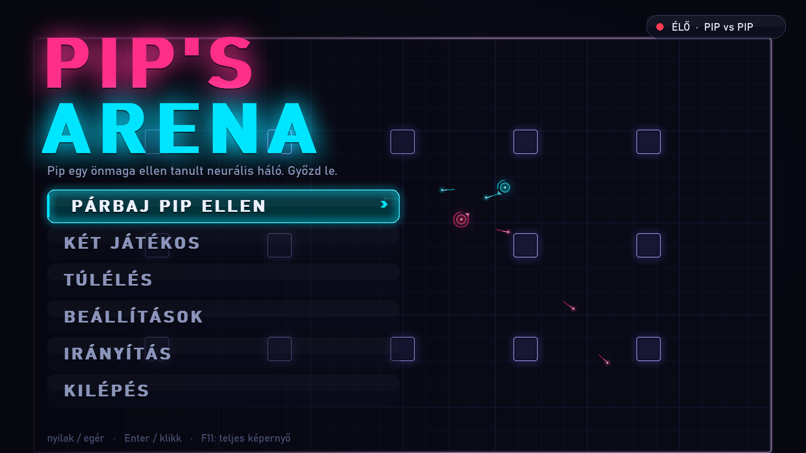
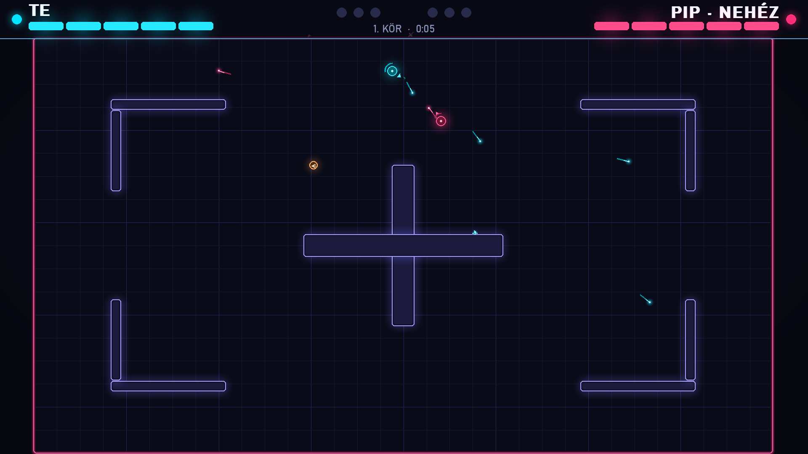
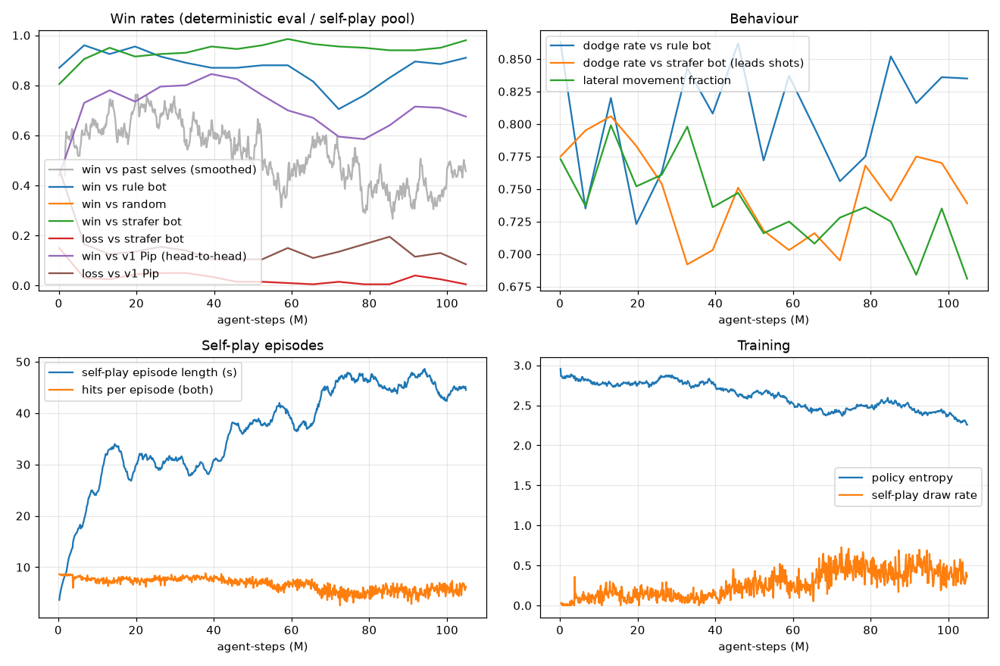

# Pip's Arena — a neon 2D dodge & shoot game against a self-play-trained reflex AI

A top-down neon arena shooter. You fight **Pip**, a small neural network (~95k parameters) that
learned the game purely by playing against itself. It moves, dodges, leads its shots, uses cover
and picks up weapons.

Every decision Pip makes (where to move, how far to lead the aim, whether to fire) is **one
forward pass of a small MLP per frame, ~14 µs on the CPU**. There is no search, no scripted
behaviour and no LLM. Everything runs locally as one process.

- **Modes:**
  - duel vs Pip (5 difficulty levels)
  - two players on one keyboard
  - wave survival (up to 6 Pips at once)
- **World:** a native 1920×1080 renderer; 6 designed maps with cover plus random maps.
- **Pickups:** shotgun, rapid fire, railgun (2 damage), shield and heal.
- **Feel:**
  - hit-stop and a slow-motion beat on the killing blow, then a kill-cam replay
  - screen shake and recoil kick
  - muzzle flashes, wall-impact sparks, motion trails
  - a directional damage indicator
- **Sound:** synthesised sound effects (numpy, no audio files).

```
python play.py
```





---

## Setup

Windows / Python 3.14, RTX 5070 (Blackwell needs CUDA 12.8+ PyTorch wheels). Training uses the
GPU; playing needs no GPU.

```powershell
python -m venv .venv
.\.venv\Scripts\python -m pip install torch --index-url https://download.pytorch.org/whl/cu128
.\.venv\Scripts\python -m pip install numpy pygame-ce matplotlib pytest
.\.venv\Scripts\python play.py
```

`pygame-ce` is a drop-in pygame fork (`import pygame`) with Python 3.14 wheels. Device selection
for training is one value in `config.py`: `DEVICE = "auto"` (CUDA if available, else CPU).

## Play

```
python play.py                                        # main menu (Hungarian UI), fullscreen
python play.py --mode duel --difficulty hard --map maze
python play.py --mode pvp --map pillars               # two players, one keyboard
python play.py --mode survival --windowed
```

| | Single player (duel, survival) | Two players |
|---|---|---|
| Move | WASD / arrows | P1: WASD · P2: arrows |
| Aim | mouse | the direction you last moved (hold L-Shift / R-Shift to keep facing while strafing) |
| Shoot | left click / Space (hold) | P1: Space or F · P2: Enter / R-Ctrl |

Other keys:
- **Esc / P:** pause
- **Tab:** Pip's "thoughts": its chosen move and its decision time per frame
- **M:** sound on/off
- **F11:** fullscreen

The whole map is always visible; there is no camera zoom.

**Modes:**
- **Duel:** first to 3 rounds, with a 3-2-1 countdown. The killing blow triggers a slow-motion
  beat and then a half-speed kill-cam replay. The results screen compares you and Pip on
  accuracy, hits, dodges and shots. Your record is kept per difficulty.
- **Two players:** the same duel flow, with a running P1–P2 tally.
- **Survival:** waves of Pips, from 1× beginner up to 6 at once with impossible ones. You have
  10 HP and heal 3 after each wave; enemies have 3 HP. Score: 100×wave per kill, 250×wave per
  wave, +500 for a flawless wave. The high score is saved. Each enemy runs the same 1v1 policy
  and sees its own duel view against you, so multi-enemy play needs no retraining.

**Maps:** Open, Pillars, Cross, Bunkers, Corridors, Maze, or a new random symmetric layout. All
maps are point-symmetric, so neither spawn side is favoured.

**Pickups** spawn every 4 s (max 5 on the map):

| Pickup | Effect |
|---|---|
| Shotgun | 3-pellet spread, short range, 8 shots |
| Rapid fire | 7-tick cooldown, 30 shots |
| Railgun | fast projectile, 2 damage, 5 shots |
| Shield | absorbs 2 hits (max 3) |
| Heal | +2 HP |

Settings, records and high scores live in `save.json` (set `ARENA_SAVE` to use another file).

### Difficulty levels

The levels differ only in which checkpoint is used and in human-like handicaps: reaction delay
(Pip acts on what it saw N frames ago), Gaussian aim noise, and sampled vs argmax actions.

Measured on the map mix with pickups, 300 games each (`python calibrate.py`); each cell is
Pip's win / draw / loss:

| Level | Model | Reaction | Aim noise | vs rule bot | vs strafer bot |
|---|---|---|---|---|---|
| Kezdő (beginner) | v2 ckpt 25, sampled | 250 ms | 10° | 4 / 8 / 88% | 0 / 3 / 97% |
| Könnyű (easy) | v2 ckpt 100, sampled | 133 ms | 5° | 40 / 9 / 51% | 0 / 3 / 97% |
| Közepes (medium) | v2 best, sampled | 67 ms | 0° | 55 / 9 / 36% | 9 / 7 / 84% |
| Nehéz (hard) | v2 best, sampled | 33 ms | 0° | 70 / 9 / 22% | 57 / 10 / 33% |
| Lehetetlen (impossible) | v2 best, argmax | 0 | 0° | 83 / 10 / 7% | 92 / 5 / 3% |

---

## How Pip works

### Network (`model.py`)

- **Actor:** 94 → 256 → 256 → three softmax heads, tanh activations. **94,738 parameters**
  (~380 KB), ~0.2 MFLOP per decision. This is the part the game runs.
  - move: 9 choices (stop + 8 directions)
  - aim: 7 choices, an offset of −30°…+30° from the line to the opponent
  - shoot: 2 choices (no / yes)
- **Critic (training only):** 94 → 256 → 256 → 1.

At play time the actor runs as a plain numpy MLP (`FastPolicy`). For a single observation this
beats both torch-CPU and CUDA: ~14 µs for the forward pass, ~100 µs including the state encoding.

### State encoding (`encoding.py`): 94 floats, egocentric

Relative distances use a fixed length scale (800/600/1000 units), not the map size, so a fight
looks the same to the network on any map.

| Index | Features | # |
|---|---|---|
| 0–5 | self: position (normalised to the map), velocity, HP fraction, cooldown | 6 |
| 6–14 | opponent: dx, dy, distance, bearing (cos, sin), velocity, HP, cooldown | 9 |
| 15 | line of sight to the opponent (1 = clear) | 1 |
| 16–23 | ray distance to the nearest wall/cover in 8 directions | 8 |
| 24–65 | 6 most imminent incoming projectiles × (dx, dy, vx, vy, **predicted miss distance**, **time to closest approach**, present) | 42 |
| 66 | fraction of round time left | 1 |
| 67–71 | own weapon (one-hot: shotgun, rapid, rail), ammo fraction, shield | 5 |
| 72–75 | opponent's weapon (one-hot), shield | 4 |
| 76–93 | 2 nearest pickups × (dx, dy, distance, type one-hot ×5, present) | 18 |

Features 0–66 are exactly the v1 encoding. That is what made the warm start possible.

### Training (`train.py`): PPO self-play on the GPU

- **Games:** 512 parallel games from the vectorised numpy engine (`engine.py`). Both players'
  experience is used, giving 1024 samples per tick; a 128-tick rollout gives 131k samples per
  PPO iteration (4 epochs, minibatch 8192).
- **Opponents:**
  - 80% of games: current policy vs itself.
  - 20%: current policy vs a frozen past snapshot (a pool of 20), which guards against strategy
    cycling.
- **Hyperparameters:** γ = 0.995, GAE λ = 0.95, clip 0.2, Adam 3e-4 decayed, entropy bonus annealed.
- **Reward, per agent per tick:**
  - +1 per hit landed, −1 per hit taken
  - +5 for a win, −5 for a loss
  - **−3 each for a draw**
  - +0.2 per pickup
  - −0.002 per tick
- **Maps:** every episode gets a new map: 20% open, 35% designed, 45% random.

**History:**
1. **v1:** trained from scratch in 40 min (156M steps) on an open 800×600 arena. Its results are
   below.
2. **v2:** the v1 actor was **widened from 67 to 94 inputs with zero weights** for the new
   features, so it started out behaving exactly like v1. It then trained for 50 min (105M steps)
   on the 1920×1080 maps with cover and pickups, with 5 critic-only warm-up iterations.
3. **What went wrong first, and the fix:** without a draw penalty, self-play on big maps with
   cover collapsed into mutual hiding. Draws rose to 50–65% and hits per game fell from 8.5
   to 4. The −3 draw penalty fixed the early phase. Even with it, the self-play draw rate crept
   back up to ~40% after ~70M steps, and strength against v1 peaked around 40M steps
   (`runs/v2/reward_curve.png`). That is why the final model is picked by a checkpoint sweep and
   not simply the last one.



### v2 checkpoint sweep (`python sweep.py`)

300 games each, map mix with pickups. Each cell is win / draw / loss:

| Checkpoint | vs strafer bot | vs v1 Pip (head-to-head) |
|---|---|---|
| ckpt 100 | 92.0 / 4.7 / 3.3% | 79.0 / 8.0 / 13.0% |
| ckpt 200 | 92.0 / 4.0 / 4.0% | 77.0 / 8.7 / 14.3% |
| **ckpt 300 → `best.pt`** | **93.7 / 3.7 / 2.7%** | **87.7 / 3.3 / 9.0%** |
| ckpt 400 | 96.0 / 3.3 / 0.7% | 74.7 / 12.3 / 13.0% |
| ckpt 500 | 97.3 / 1.7 / 1.0% | 67.7 / 19.0 / 13.3% |
| ckpt 600 | 94.0 / 5.3 / 0.7% | 61.0 / 25.7 / 13.3% |
| ckpt 700 | 95.7 / 2.3 / 2.0% | 76.3 / 14.0 / 9.7% |
| ckpt 800 (final) | 95.0 / 4.0 / 1.0% | 69.0 / 22.0 / 9.0% |

Later checkpoints are about as strong against the strafer, but play more cautiously and draw far
more. ckpt 300 is the most decisive, and also the most fun to play against.

### v1 results (open 800×600 arena, 1000 games each)

| v1 best vs | win | draw | loss |
|---|---|---|---|
| random bot | 100% | 0% | 0% |
| rule bot (charges you, aims straight, fires on cooldown) | 99.4% | 0.2% | 0.4% |
| strafer bot (circle-strafes, leads shots, side-steps incoming fire) | 99.8% | 0.1% | 0.1% |

For reference, the strafer beats the rule bot 100%, and strafer vs strafer is a 99.8% draw. The
3-minute smoke model lost to the strafer 97% of the time.

Behaviour analysis of v1 vs the strafer:
- **It closes in and corners it:** at the moment of a hit, the median distance is 79 units and
  the strafer is 70 units from a wall.
- **It brackets its shots:** aim is split evenly across −10°/0°/+10°.
- **It jukes:** it changes direction ~11 times per second and never stands still.


## Performance

These are measured headless while a training run was using the GPU and CPU at the same time.

- **Frame time:**
  - duel: mean 7.6 ms, 99th percentile 9.6 ms (budget 16.7 ms)
  - survival: mean 7.8 ms, 99th percentile 12.8 ms
- **Removed hitches:**
  - big glow texts are blurred at quarter resolution and pre-rendered
  - all AI models are loaded up front
  - glow sprites are quantised and cached
  - GC is tuned so full collections run between rounds, not mid-fight

## Retrain / evaluate

```
python -m pytest -q tests                                        # 35 tests
python train.py --minutes 40 --run main --no-maps --no-items     # v1-style run (open arena)
python train.py --minutes 50 --run v2 --warm-start runs/main/best.pt --critic-warmup 5 \
       --ent-start 0.004 --ent-end 0.0005
python sweep.py --run v2 --ref runs/main/best.pt --every 100      # picks runs/v2/best.pt
python calibrate.py                                              # difficulty table above
python evaluate.py --ckpt runs/v2/best.pt --maps                 # vs random / rule / strafer
```

The v1 numbers above were measured with v1's configuration (800×600 open arena). The code now
defaults to the v2 world, so a v1-style rerun isn't bit-identical.

## Files

| File | What |
|---|---|
| `config.py` | all constants: world, weapons, pickups, rewards, PPO |
| `engine.py` | batched numpy simulation: N agents/teams, per-env maps, weapons, shields, pickups |
| `maps.py` | designed maps + random symmetric generator + training map mix |
| `encoding.py` | 94-float state encoding, action decoding |
| `model.py` | actor/critic, numpy `FastPolicy`, checkpoint I/O, `widen_actor` |
| `train.py` / `sweep.py` / `calibrate.py` / `evaluate.py` / `plot.py` | training, checkpoint selection, difficulty measurement, evaluation, curves |
| `bots.py` | random, rule and strafer baselines |
| `world.py` | play-time wrapper (events, 1v1 views for each enemy), `AIController` + difficulty presets |
| `play.py` / `gfx.py` / `sound.py` | the game, the neon renderer, synthesised sound effects |
| `tests/` | 35 tests (collisions, walls, weapons, shields, pickups, maps, teams, encoding, numpy ≡ torch, world ≡ engine) |
| `runs/main/`, `runs/v2/` | the models the game loads, plus logs and curves |
